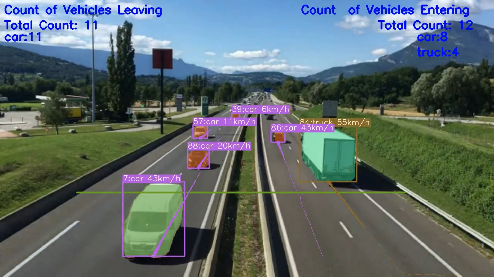
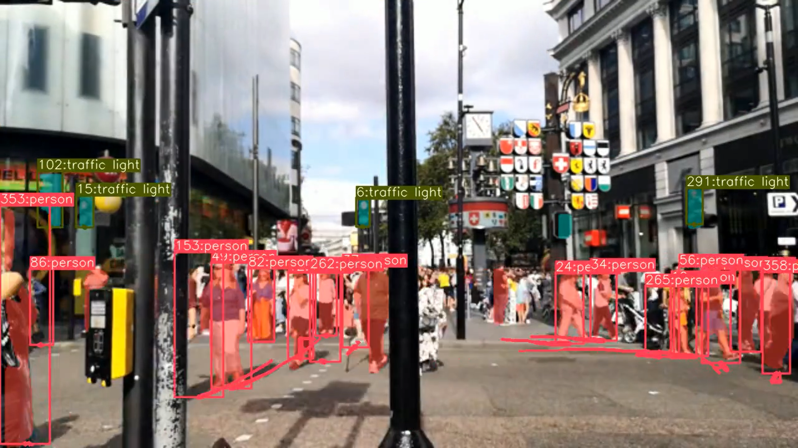

# YOLOv8_Custom_Dataset
YOLOv8_Custom_Dataset yaratildi
OLOv8 real vaqt rejimida obyektlarni aniqlash algoritmi boʻlib, u tasvir va videolardagi obyektlarni aniqlash uchun ishlatilishi mumkin. Bu juda kuchli algoritm, lekin maxsus ma'lumotlar to'plamida mashq qilish qiyin bo'lishi mumkin. YOLOv8 ni maxsus maʼlumotlar toʻplamida oʻrgatish uchun quyidagi qadamlarni bajarishingiz mumkin:
<H1 align="center">
YOLOv8 Segmentatsiyasi DeepSORT Ob'ektni kuzatish (ID + Trails)  </H1>

## Google Colab fayl havolasi (Bir marta bosish bilan yechim)
Yolov8 segmentatsiyasi va kuzatuvi uchun google colab fayli havolasi quyida keltirilgan, siz Google Colab ilovasi va uning bir marta bosish orqali amalga oshirilishini tekshirishingiz mumkin.
,siz shunchaki GPU sifatida ish vaqtini tanlashingiz va Hammasini ishga tushirish-ni bosishingiz kerak.

[`Google Colab File`](https://colab.research.google.com/drive/1wRkrquf_HMV7tyKy2zDAuqqK9G4zZub5?usp=sharing)


## YOLOv8 with DeepSORT Object Tracking

[`Github Repo Link`](https://github.com/botir2/profile-picture-YOLOv8_Custom_Dataset.git)

## Shaxsiy ma'lumotlarda YOLOv8 yordamida ob'ektni segmentatsiyalash va kuzatish (ID + Trails)
## Google Colab fayl havolasi (Bir marta bosish yechimi)
[`Google Colab File`](https://colab.research.google.com/drive/1cnr9Jjj5Pag5myK6Ny8v5gtHgOqf6uoF?usp=sharing)

## YouTube Video Tutorial Link

[`YouTube Link`](https://www.youtube.com/watch?v=e-uzr2Sm0DA)

## Kodni ishga tushirish qadamlari

- Repozitariyni klonlash
```
git clone https://github.com/botir2/profile-picture-YOLOv8_Custom_Dataset.git
```
- Klonlangan papkaga o'ting.
```
cd YOLOv8_Segmentation_DeepSORT_Object_Tracking
```
- Install the Dependencies
```
pip install -e '.[dev]'

```
- Setting the Directory.
```
cd ultralytics/yolo/v8/segment

```
- Google Drive-dan DeepSORT fayllarini yuklab olish
```

https://drive.google.com/drive/folders/1kna8eWGrSfzaR6DtNJ8_GchGgPMv3VC8?usp=sharing
```
- DeepSORT Zip faylini drayverdan yuklab olgandan so'ng, uni oching va pastki papkalarga o'ting va deep_sort_pytorch jildini ultralytics/yolo/v8/segment jildiga joylashtiring.

- Google Drive-dan namunaviy videolarni yuklab olish

```
gdown "https://drive.google.com/uc?id=19P9Cf9UiJ9gU9KHnAfud6hrFOgobETTX"
```


```
gdown "https://drive.google.com/uc?id=1rjBn8Fl1E_9d0EMVtL24S9aNQOJAveR5&confirm=t"
```

gdown "https://drive.google.com/uc?id=1aL0XIoOQlHf9FBvUx3FMfmPbmRu0-rF-&confirm=t"
```
- Quyidagi buyruq bilan kodni ishga tushiring.

- Yolov8 segmentatsiyasi + Kuzatuv uchun
```
python predict.py model=yolov8x-seg.pt source="test1.mp4"
```

### RESULTS

#### Ob'ektni segmentlash va DeepSORT kuzatish (ID + Trails) va transport vositalarini hisoblash


#### Ob'ektni segmentlash va DeepSORT kuzatish (ID + Trails)



### To'liq bosqichma-bosqich tushuntirishni tomosha qiling


## References
- https://github.com/ultralytics/ultralytics
